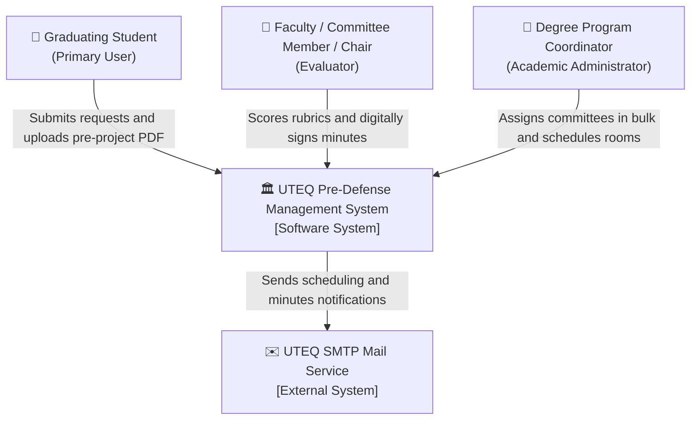
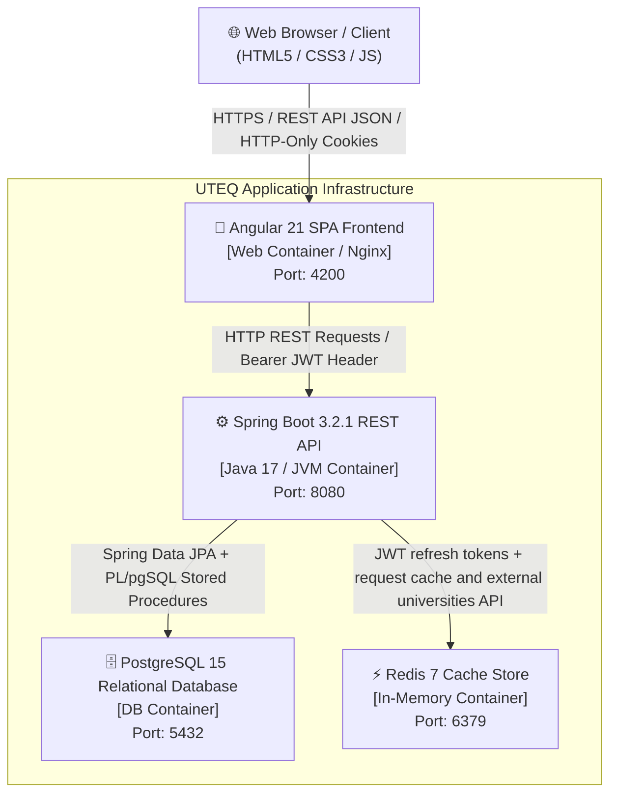
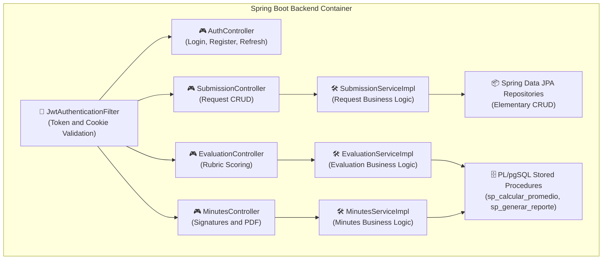

# 🏛️ SYSTEM ARCHITECTURE (C4 MODEL)

**Project:** UTEQ Pre-Defense Management System
**Standard:** C4 Model (Simon Brown) — Levels 1, 2 and 3

*(Rest of this repository's documentation is in Spanish, the language of the academic report; these
three diagrams and their labels are kept in English per the reviewer's requirement, so they can be
read/indexed independently of the surrounding prose.)*

---

## 📌 Level 1: System Context Diagram

The diagram below shows how the **UTEQ Pre-Defense Management System** interacts with the different
people (roles) and external systems.

---

## 📌 Level 2: Container Diagram

The container diagram describes the high-level applications and data stores that make up the system.

---

## 📌 Level 3: Backend Component Diagram

The component diagram details the internal structure of the Backend container (`presustentaciones.jar`).

