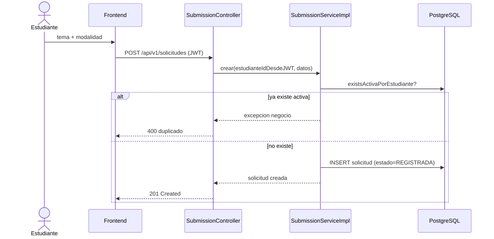

# CU-02: Registrar solicitud de pre-sustentación

**Nivel Cockburn:** 🌊 Mar · **Requisito:** RF-02 · **Historia relacionada:** [`../historias/HU-02.md`](../historias/HU-02.md)

**Actor primario:** Estudiante egresado autenticado.
**Interesados:** *Estudiante* (iniciar su proceso), *Coordinador* (recibir solicitudes válidas para gestionar).
**Precondición:** el estudiante está autenticado (CU-01) y no tiene una solicitud activa.
**Garantía de éxito:** la solicitud queda creada, asociada al estudiante autenticado (no a un ID recibido del cliente), en estado inicial.
**Disparador:** el estudiante completa el formulario de registro de solicitud.

## Escenario principal
1. El estudiante ingresa título de tema y modalidad de titulación.
2. El frontend envía `POST /api/v1/solicitudes` con el token JWT.
3. El sistema resuelve el estudiante desde el JWT (no del cuerpo de la petición).
4. El sistema verifica que no exista una solicitud activa previa del mismo estudiante.
5. El sistema crea la solicitud en estado `REGISTRADA`.
6. El sistema dispara una notificación al coordinador (CU-08, subfunción).

## Extensiones
- **4a.** Ya existe una solicitud activa → el sistema rechaza con mensaje explícito, no crea duplicado.
- **2a.** Token inválido o ausente → 401/403 antes de llegar a la lógica de negocio.

**Postcondición:** existe una fila en `solicitudes` vinculada al estudiante, lista para recibir el anteproyecto (CU-12).

## Diagrama de secuencia

## Trazabilidad
- **Prueba automatizada:** ❌ `SubmissionServiceImplTest.java` no existe (hallazgo Fase 6).
- **Prueba de integración real:** ❌ no existe.
