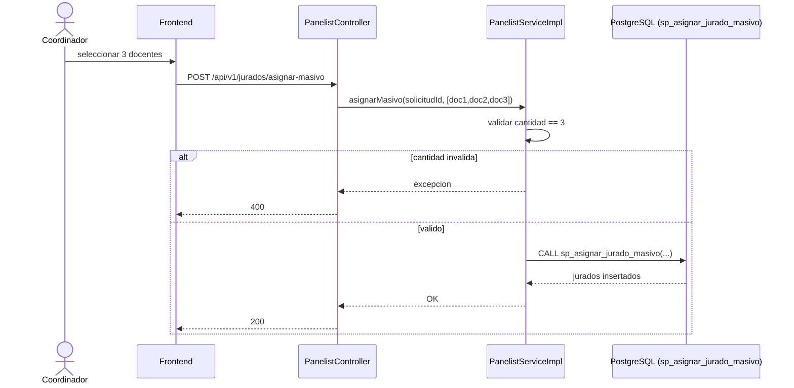

# CU-03: Asignar jurados a una solicitud

**Nivel Cockburn:** 🌊 Mar · **Requisito:** RF-03 · **Historia relacionada:** [`../historias/HU-03.md`](../historias/HU-03.md)

**Actor primario:** Coordinador de carrera.
**Interesados:** *Coordinador* (conformar tribunal), *Docentes* (ser notificados de su asignación), *Estudiante* (saber quién lo evaluará).
**Precondición:** existe una solicitud con anteproyecto aprobado (CU-12) y al menos 3 docentes disponibles.
**Garantía de éxito:** el tribunal queda conformado con exactamente 3 jurados.
**Disparador:** el coordinador selecciona 3 docentes y confirma la asignación.

## Escenario principal
1. El coordinador consulta docentes disponibles.
2. Selecciona 3 y envía `POST /api/v1/jurados/asignar-masivo`.
3. El sistema (`sp_asignar_jurado_masivo`) valida que sean exactamente 3 y los inserta como jurados de la solicitud.
4. El sistema dispara notificación (CU-08) a cada docente asignado.

## Extensiones
- **3a.** Se envían menos o más de 3 docentes → el sistema rechaza la operación.
- **3b.** Un docente ya está asignado como jurado de esa misma solicitud → se rechaza duplicado.

**Postcondición:** existen 3 filas en `jurados` vinculadas a la solicitud; el proceso puede avanzar a CU-04 (programar cronograma).

## Diagrama de secuencia

## Trazabilidad
- **Prueba automatizada:** ✅ `PanelistServiceImplTest.java` (5 tests, 53% cobertura de líneas real).
- **Prueba de integración real:** ❌ no existe (el test es unitario con mocks del repositorio, no ejecuta el SP contra una BD real).
