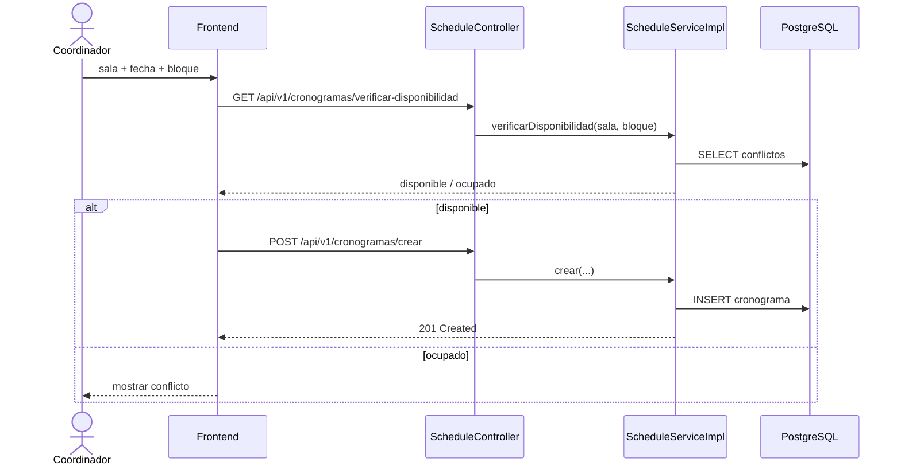

# CU-04: Programar cronograma de defensa

**Nivel Cockburn:** 🌊 Mar · **Requisito:** RF-04 · **Historia relacionada:** [`../historias/HU-04.md`](../historias/HU-04.md)

**Actor primario:** Coordinador de carrera.
**Interesados:** *Coordinador*, *Jurados y estudiante* (necesitan fecha/sala confirmada), *Administrador de salas* (evitar choques).
**Precondición:** tribunal conformado (CU-03); existe al menos una sala registrada (CU-10) disponible en el bloque deseado.
**Garantía de éxito:** el cronograma queda creado sin conflicto de sala/horario.
**Disparador:** el coordinador elige sala, fecha y bloque horario.

## Escenario principal
1. El coordinador consulta disponibilidad (`GET /api/v1/cronogramas/verificar-disponibilidad`).
2. El sistema confirma que la sala está libre en ese bloque.
3. El coordinador confirma y envía `POST /api/v1/cronogramas/crear`.
4. El sistema crea el cronograma en estado `PROGRAMADO`.
5. El sistema dispara notificación (CU-08) a jurados y estudiante.

## Extensiones
- **2a.** Sala ocupada en ese bloque → el sistema informa el conflicto, no permite continuar.
- **3a.** Se solicita auto-asignación (`POST /api/v1/cronogramas/auto/{solicitudId}`) → el sistema busca el primer bloque/sala libres automáticamente.

**Postcondición:** existe un cronograma vinculado a la solicitud; el proceso puede avanzar a CU-05 (evaluación) en la fecha programada.

## Diagrama de secuencia

## Trazabilidad
- **Prueba automatizada:** ❌ `ScheduleServiceImplTest.java` no existe (hallazgo Fase 6).
- **Prueba de integración real:** ❌ no existe.
