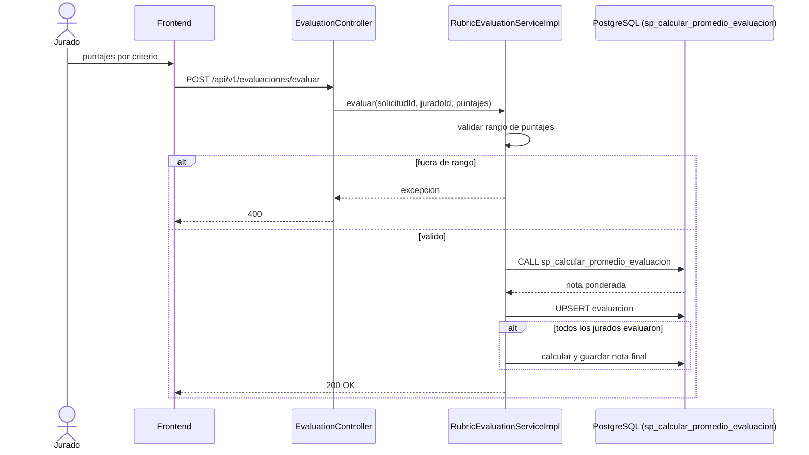

# CU-05: Evaluar por rúbrica

**Nivel Cockburn:** 🌊 Mar · **Requisito:** RF-05 · **Historia relacionada:** [`../historias/HU-05.md`](../historias/HU-05.md)

**Actor primario:** Jurado calificador (docente asignado, CU-03).
**Interesados:** *Jurado*, *Estudiante* (recibir una nota justa y trazable), *Presidente del tribunal* (consolidar el resultado).
**Precondición:** cronograma vigente (CU-04); la defensa oral ya se realizó (fuera del sistema).
**Garantía de éxito:** la nota ponderada del jurado queda calculada y almacenada; cuando todos los jurados evalúan, se calcula la nota final.
**Disparador:** el jurado completa el formulario de rúbrica tras la defensa.

## Escenario principal
1. El jurado abre la rúbrica de la solicitud (criterios: Propuesta, Documento, Exposición).
2. Ingresa un puntaje por criterio dentro del rango permitido.
3. Envía `POST /api/v1/evaluaciones/evaluar`.
4. El sistema calcula la nota ponderada de ese jurado (`sp_calcular_promedio_evaluacion`).
5. Si es el último jurado en evaluar, el sistema calcula y persiste la nota final agregada.

## Extensiones
- **2a.** Puntaje fuera de rango → el sistema rechaza la evaluación antes de persistir.
- **5a.** Aún faltan jurados por evaluar → el sistema guarda la evaluación individual y espera a los demás.

**Postcondición:** existe una evaluación por jurado; si están completas, existe la nota final agregada, habilitando CU-06 (generar acta).

## Diagrama de secuencia

## Trazabilidad
- **Prueba automatizada:** ✅ `RubricEvaluationServiceImplTest.java` (4 tests).
- **Prueba de integración real:** ❌ no existe (no ejecuta el SP contra una BD real).
