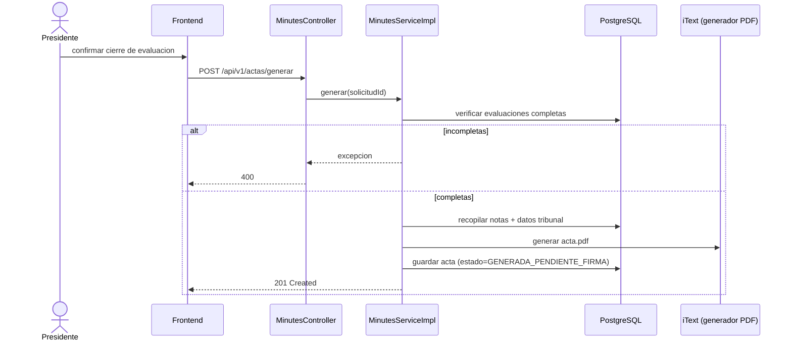

# CU-06: Generar acta de pre-sustentación

**Nivel Cockburn:** 🌊 Mar · **Requisito:** RF-06 · **Historia relacionada:** [`../historias/HU-06.md`](../historias/HU-06.md)

**Actor primario:** Presidente del tribunal.
**Interesados:** *Presidente*, *Estudiante* (obtener constancia formal), *Coordinación académica* (archivo institucional).
**Precondición:** todas las evaluaciones de jurado están completas (CU-05).
**Garantía de éxito:** se genera un PDF con los resultados consolidados, en estado "pendiente de firma".
**Disparador:** el presidente confirma el cierre de la evaluación.

## Escenario principal
1. El presidente verifica que las 3 evaluaciones de jurado estén completas.
2. Envía `POST /api/v1/actas/generar`.
3. El sistema recopila notas, datos del estudiante y del tribunal.
4. El sistema genera el PDF del acta (iText) y lo almacena.
5. El acta queda en estado `GENERADA_PENDIENTE_FIRMA`, habilitando CU-07.

## Extensiones
- **1a.** Evaluaciones incompletas → el sistema rechaza la generación.

**Postcondición:** existe un acta en PDF vinculada a la solicitud, lista para el flujo de firma (CU-07).

## Diagrama de secuencia

## Trazabilidad
- **Prueba automatizada:** ❌ `MinutesServiceImplTest.java` no existe (hallazgo Fase 6).
- **Prueba de integración real:** ❌ no existe.
