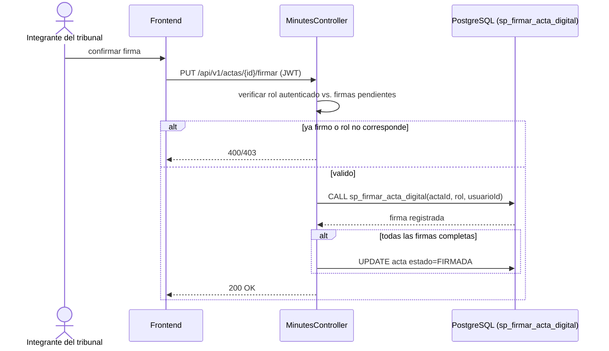

# CU-07: Firmar acta digitalmente

**Nivel Cockburn:** 🐟 Pez (subfunción de CU-06) · **Requisito:** RF-07 · **Historia relacionada:** [`../historias/HU-07.md`](../historias/HU-07.md)

**Actor primario:** Integrante del tribunal (presidente, vocal 1, vocal 2 o tutor).
**Interesados:** *Firmante*, *Estudiante* (validez legal de su resultado), *Institución* (registro de auditoría de quién y cuándo firmó).
**Precondición:** existe un acta generada (CU-06) pendiente de la firma de ese actor específico.
**Garantía de éxito:** la firma queda registrada con marca de tiempo; cuando todos firman, el acta pasa a estado final.
**Disparador:** el actor autenticado confirma su firma.

## Escenario principal
1. El actor abre el acta pendiente de su firma.
2. Envía `PUT /api/v1/actas/{id}/firmar`.
3. El sistema verifica que el actor autenticado corresponde a un rol pendiente de firma en esa acta específica.
4. El sistema registra la firma (`sp_firmar_acta_digital`) con marca de tiempo.
5. Si todos los actores requeridos ya firmaron, el acta pasa a estado `FIRMADA`.

## Extensiones
- **3a.** El actor ya firmó antes → el sistema rechaza la doble firma.
- **3b.** El actor no corresponde a ningún rol pendiente de esa acta → 403 Forbidden.

**Postcondición:** queda un registro inmutable de la firma; el acta avanza hacia su cierre definitivo.

## Diagrama de secuencia

## Trazabilidad
- **Prueba automatizada:** ❌ no existe (comparte el vacío de cobertura de `MinutesServiceImpl`).
- **Prueba de integración real:** ❌ no existe.
