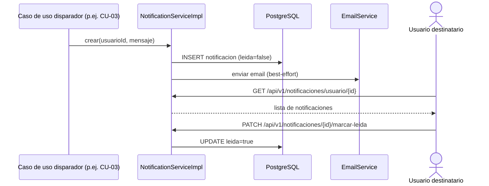

# CU-08: Notificar cambio de estado

**Nivel Cockburn:** 🐟 Pez (subfunción disparada por CU-02, CU-03, CU-04, CU-06) · **Requisito:** RF-08 · **Historia relacionada:** [`../historias/HU-08.md`](../historias/HU-08.md)

**Actor primario:** El propio sistema (disparado por eventos internos, no por acción directa de un usuario).
**Actor secundario:** Usuario destinatario (consulta sus notificaciones).
**Interesados:** *Usuario destinatario* (enterarse sin consultar manualmente).
**Precondición:** ocurrió un evento relevante (asignación de jurado, cronograma programado, acta generada, etc.).
**Garantía de éxito:** se crea una notificación persistente asociada al usuario destinatario.
**Disparador:** evento interno de otro caso de uso (p. ej. CU-03 paso 4).

## Escenario principal
1. Un caso de uso de nivel Mar completa una acción relevante para otro actor.
2. El sistema invoca `NotificationServiceImpl.crear(usuarioId, mensaje)`.
3. Se persiste la notificación en estado "no leída".
4. (Opcional) se envía también por email vía `EmailService`.
5. El usuario destinatario consulta `GET /api/v1/notificaciones/usuario/{id}` y ve la notificación.
6. El usuario marca como leída con `PATCH /api/v1/notificaciones/{id}/marcar-leida`.

## Extensiones
- **4a.** Falla el envío de email → la notificación in-app ya persistida no se pierde (el email es best-effort).

**Postcondición:** el usuario destinatario tiene una notificación disponible para consultar.

## Diagrama de secuencia

## Trazabilidad
- **Prueba automatizada:** ❌ `NotificationServiceImplTest.java` no existe (hallazgo Fase 6).
- **Prueba de integración real:** ❌ no existe.
