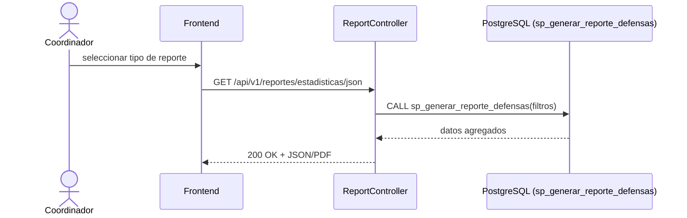

# CU-09: Generar reportes de gestión

**Nivel Cockburn:** 🪁 Cometa (resumen que agrega datos de CU-02, CU-03, CU-04, CU-05, CU-06) · **Requisito:** RF-09 · **Historia relacionada:** [`../historias/HU-09.md`](../historias/HU-09.md)

**Actor primario:** Coordinador de carrera.
**Interesados:** *Coordinador* (visibilidad agregada), *Dirección de carrera* (indicadores de gestión).
**Precondición:** existen solicitudes/defensas registradas en el sistema (cualquier estado).
**Garantía de éxito:** el reporte refleja el estado real y actual de las defensas al momento de generarlo.
**Disparador:** el coordinador solicita un reporte (estadístico o de cronograma).

## Escenario principal
1. El coordinador selecciona el tipo de reporte (estadísticas JSON, cronograma PDF).
2. Envía `GET /api/v1/reportes/estadisticas/json` o `GET /api/v1/reportes/cronograma/pdf`.
3. El sistema agrega datos de solicitudes, cronogramas y evaluaciones (`sp_generar_reporte_defensas`).
4. El sistema responde con el reporte solicitado.

## Extensiones
- **3a.** No hay datos para el periodo/filtro solicitado → el sistema responde con un reporte vacío, no con error.

**Postcondición:** el coordinador obtiene una vista agregada y actualizada del proceso de titulación.

## Diagrama de secuencia

## Trazabilidad
- **Prueba automatizada:** ❌ no existe.
- **Prueba de integración real:** ❌ no existe.
- **Nota de corrección respecto a `matriz.csv` v0.9.0-rc:** citaba "k6 Load Test Run 2 JSON" como evidencia de este CU. Verificado contra [`../../../k6/load-test.js`](../../../k6/load-test.js): el script ejercita `/catalogos/modalidades` y `/universidades`, **no** `/reportes/**` — esa cita de evidencia era incorrecta y se corrige en `matriz.csv` v1.0.0 a "sin evidencia automatizada".
