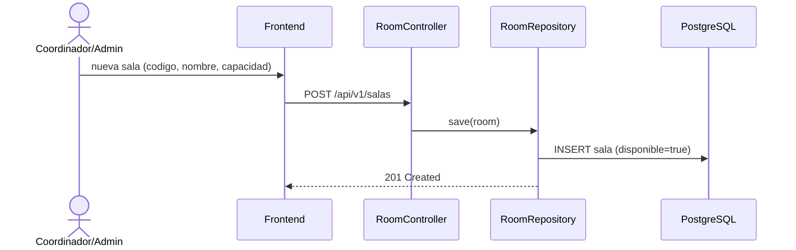

# CU-10: Gestionar catálogo de salas

**Nivel Cockburn:** 🌊 Mar · **Requisito:** RF-10 · **Historia relacionada:** [`../historias/HU-10.md`](../historias/HU-10.md)

**Actor primario:** Coordinador o Administrador.
**Interesados:** *Coordinador* (necesita salas reales para CU-04), *Administrador* (mantiene el catálogo).
**Precondición:** el actor está autenticado con rol Coordinador o Administrador.
**Garantía de éxito:** el catálogo de salas queda actualizado y disponible para CU-04.
**Disparador:** el actor registra o elimina una sala.

## Escenario principal
1. El actor consulta el listado (`GET /api/v1/salas`).
2. Registra una sala nueva (`POST /api/v1/salas` con código, nombre, capacidad).
3. El sistema la marca como disponible por defecto.

## Extensiones
- **3a.** Se solicita eliminar una sala con cronogramas asociados → el sistema rechaza la eliminación para no romper CU-04.

**Postcondición:** el catálogo de salas refleja el estado real de los espacios disponibles.

## Diagrama de secuencia

## Trazabilidad
- **Prueba automatizada:** ❌ no existe (hallazgo Fase 6). La matriz `v0.9.0-rc` citaba
  `SalaServiceImplTest.java`, pero esa prueba nunca se escribió **y la clase que probaría tampoco
  existió nunca**: el diagrama de arriba mostraba un `SalaServiceImpl` inventado. Verificado con
  `git log --all --diff-filter=A -- "*SalaService*" "*RoomService*"`, que no devuelve nada. Este
  módulo no tiene capa de servicio: `RoomController` usa `RoomRepository` directamente.
- **Prueba de integración real:** ❌ no existe.
