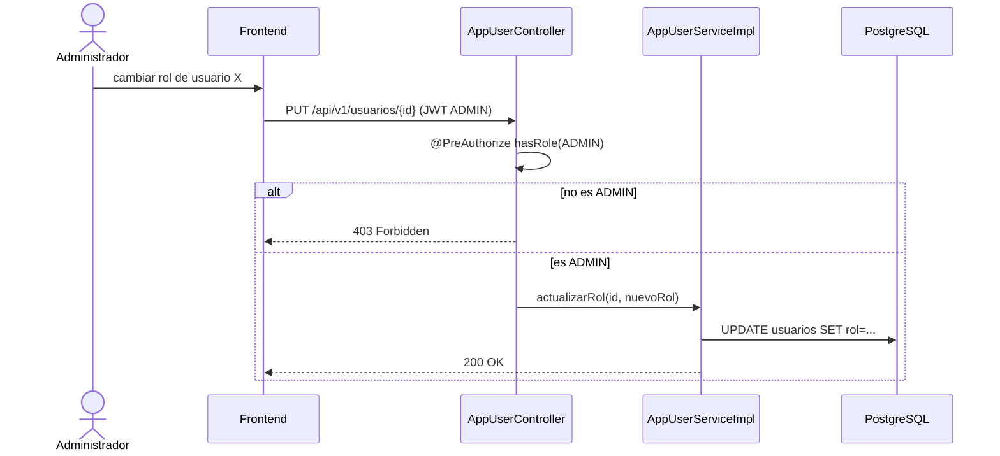

# CU-11: Gestionar usuarios del sistema

**Nivel Cockburn:** 🌊 Mar · **Requisito:** RF-11 · **Historia relacionada:** [`../historias/HU-11.md`](../historias/HU-11.md)

**Actor primario:** Administrador.
**Interesados:** *Administrador* (control de acceso), *Todos los usuarios* (dependen de que su rol esté bien asignado).
**Precondición:** el actor está autenticado con rol ADMIN.
**Garantía de éxito:** el catálogo de usuarios y sus roles queda actualizado y consistente con el control de acceso real.
**Disparador:** el administrador crea, activa/desactiva o cambia el rol de un usuario.

## Escenario principal
1. El administrador consulta `GET /api/v1/usuarios/paginado`.
2. Selecciona un usuario y cambia su rol.
3. El sistema valida que el solicitante tenga rol ADMIN (`@PreAuthorize`).
4. El sistema actualiza el rol; el próximo token JWT del usuario afectado reflejará el nuevo rol.

## Extensiones
- **3a.** El solicitante no es ADMIN → 403 Forbidden, no se ejecuta el cambio (control de acceso corregido en la Fase 5, ver [`../../mediciones/sec/owasp/OWASP-AUDIT.md`](../../mediciones/sec/owasp/OWASP-AUDIT.md)).

**Postcondición:** el usuario afectado tiene el rol actualizado; su sesión activa (si la tiene) conserva el rol anterior hasta que renueve el token.

## Diagrama de secuencia

## Trazabilidad
- **Prueba automatizada:** ✅ `AppUserServiceImplTest.java` (8 tests, 69% cobertura de líneas real).
- **Prueba de integración real:** ❌ no existe.
