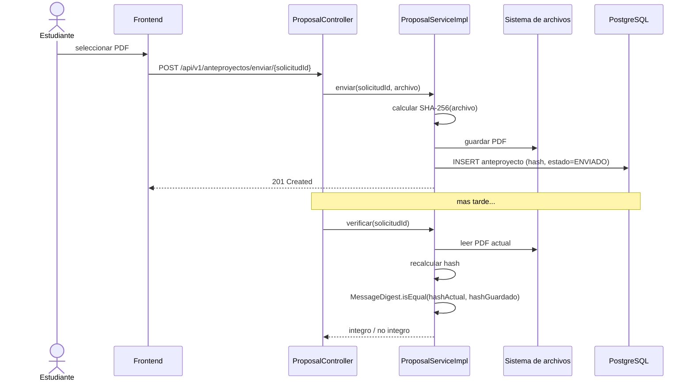

# CU-12: Cargar y verificar anteproyecto

**Nivel Cockburn:** 🌊 Mar · **Requisito:** RF-12 · **Historia relacionada:** [`../historias/HU-12.md`](../historias/HU-12.md)

**Actor primario:** Estudiante.
**Interesados:** *Estudiante* (garantía de integridad de su entrega), *Docente/Jurado* (confianza en que el documento revisado es el original), *Coordinación* (evidencia ante disputas).
**Precondición:** existe una solicitud registrada (CU-02) sin anteproyecto cargado o con uno rechazado.
**Garantía de éxito:** el PDF queda almacenado con su hash SHA-256 calculado y persistido.
**Disparador:** el estudiante sube el archivo PDF de su anteproyecto.

## Escenario principal
1. El estudiante selecciona el PDF y envía `POST /api/v1/anteproyectos/enviar/{solicitudId}` (multipart).
2. El sistema calcula el hash SHA-256 del archivo recibido.
3. El sistema almacena el archivo en disco y el hash en la base de datos.
4. El anteproyecto queda en estado `ENVIADO`.
5. (Posteriormente) un docente/coordinador solicita `GET /api/v1/anteproyectos/verificar/{solicitudId}`.
6. El sistema recalcula el hash del archivo en disco y lo compara en tiempo constante contra el hash almacenado.

## Extensiones
- **1a.** El archivo no es PDF o excede el tamaño máximo → el sistema rechaza la carga.
- **6a.** El hash recalculado no coincide (archivo alterado o corrupto) → el sistema reporta integridad NO verificada.

**Postcondición:** existe un anteproyecto con hash verificable, habilitando CU-03 (asignación de jurados) tras su aprobación.

## Diagrama de secuencia

## Trazabilidad
- **Prueba automatizada:** ✅ `ProposalServiceImplTest.java` (72% cobertura de líneas real).
- **Prueba de integración real:** ❌ no existe.
- **Evidencia empírica adicional:** hallazgo de seguridad `UNSAFE_HASH_EQUALS` (find-sec-bugs) corregido en la Fase 5 — ver [`../../mediciones/sec/static-analysis/STATIC-ANALYSIS.md`](../../mediciones/sec/static-analysis/STATIC-ANALYSIS.md).
